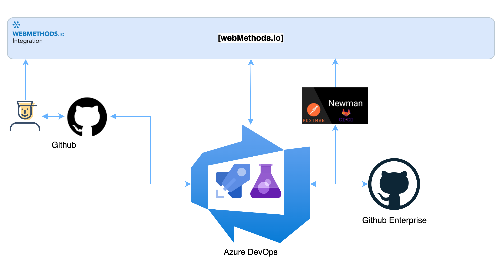
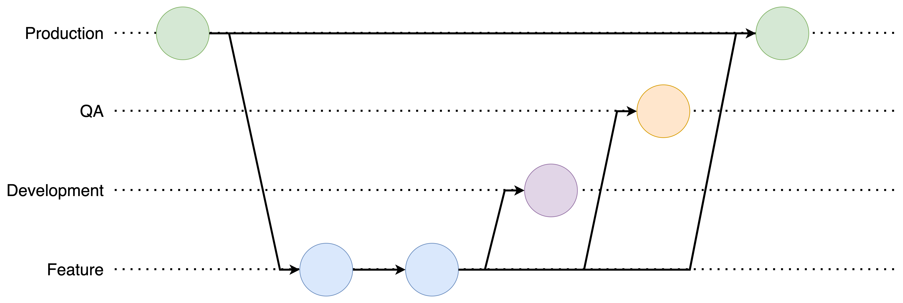

# DevOps for webMethods.IO Integration

    This article shows how to design and setup an automated CI/CD process and framework for webMethods.io 
    using the inbuilt APIs (or CLI). Here we have used Azure DevOps as our orchestration platform, 
    GitHub as repository platform and Postman/Newman as test framework. 

# Use-case
When organizations start using webMethods.io Integration for business use-cases, the need for having a continuous integration and delivery process becomes very important. These processes will enable the business to have a "Faster release rate", "More Test reliability" & "Faster to Market".

This use-case will highlight a solution utilizing webMethods.io import & export APIs (or CLI) and Azure Devops to extract and store the code assets in repository (GitHub). By integrating repository workflows and azure pipelines, this process will automate the promotion of assets to different stages/environment as per the organizations promotion workflow. This will also showcase how to automate the test framework for respective stages/environments.

  

The automation around webMethods.io Integration APIs have been implemented using scripts, which will make customization easier if the organization chooses to adopt an alternative orchestration platform.

# Assumptions / Scope / Prerequisite
1. 4 Environments: Play/build, Dev, QA & Prod. 
2. Azure DevOps as Orchestration Platform
3. GitHub: as the code repository
4. GitHub Enterprise: For Pipelines/Scripts
5. Postman/Newman as test framework

# Git Workflow
We will assume that the organization is following the below GIT Workflows.

    

# Steps
1. **Initialize**
   1. Developer starts by executing *Initialize Pipeline* (Automation)
   2. This checks if the request is for an existing asset or a new implementation
   3. If new, automation will 
      1. Initialize a repository
      2. Create standardized branches, including requested Feature Branch
      3. Create a project in Play/Build environment
   4. If existing, automation will
      1. Clone the Prod branch to Feature branch
      2. Import asset to Play/Build environment

2. **Develop & Commit**
   1. Developer starts developing
   2. After completion they will execute synchronizeToFeature Pipeline (Automation)
   3. Automation will 
      1. Export the asset
      2. Commit the asset to Feature Branch

3. **Deliver / Promote to DEV**
   1. Once the implementation is finished, developer manually creates a Pull Request from Feature Branch to DEV
   2. This will trigger the synchronizeToDev pipeline (Automation)
   3. Automation will 
      1. Checkout the DEV branch
      2. Import the asset to DEV environment
      3. And then kicks off automated test for the associated project/repo with data/assertions specific to DEV
   4. On failure, developer needs to fix/re-develop the asset (Step 2).

4. **Deliver / Promote to QA**
   1. After Dev cycle is complete, developer manually creates a Pull Request from Feature Branch to QA.  
   2. This will trigger the synchronizeToQA pipeline (Automation)
   3. Automation will 
      1. Checkout the QA branch
      2. Import the asset to QA environment
      3. And then kicks off automated test for the associated project/repo with data/assertions specific to QA
   4. On failure, developer needs to fix/re-develop the asset (Step 2).

5. **Deliver / Promote to PROD**
   1. Once the automated test and UAT is successfully finished, developer manually creates a Pull Request from Feature Branch to PROD.  PROD deployment may have different approval cycle.
   2. Respective operations team will manually trigger the synchronizeToPROD pipeline (Automation)
   3. Automation will 
      1. Checkout the PROD branch
      2. Create a release
      3. Import the asset to PROD environment
      4. And then kicks off automated Smoke test, if any for PROD.
   4. On failure, developer needs to fix/re-develop the asset (Step 2). And release will be rolled back.

# Downloads / Assets / References
1. Repository for automation, scripts & sample assets. Github: https://github.softwareag.com/PS/webmethods_io_int_cicd
2. Presentation: https://github.softwareag.com/PS/webmethods_io_int_cicd/blob/main/presentation/webMethodsIO_Integration_CICD.pptx 
3. Demo recording: 
4. API Documentation: https://docs.webmethods.io/integration/apis/webmethods_api_ref/#reference-data-apis
5. CLI Repository: https://github.com/SoftwareAG/webmethods-io-integration-apicli

# Next Steps
1. Incorporate design for Hybrid use-case
2. Extend testing framework
3. Incorporate design for code review

## How to use/test
1. Clone / Fork the automation repo
2. Adjust the environment configs
3. Configure your Azure DevOps tenant 
   1. Create Project 
   2. Link automation repo to get the pipelines
   3. In project settings, create Service Connections for Automation repository and Code Repository
4. Start the "*Initialize*" pipeline
5. Check that the respective repo and webMethods.io project is created
6. Import sample assets from automation repo
7. Start "*synchronizeToFeature*" pipeline
8. Check whether new assets have been committed to feature branch
9. Adjust the test cases for each environment from automation repo and commit it code repo feature branch created above. *Note: Follow the folder structure documented*
10. Create a Pull Request in code repository from Feature Branch to DEV
11. Start "*synchronizeToDev*" pipeline. (This has been automated for Github, please refer to Github automation document).
12. Check code has been Imported/Promoted to Dev environment
13. Check whether Test has been automatically triggered.

